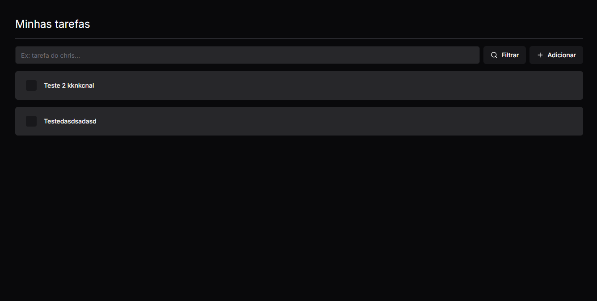

# WorkShop Padrão de Projeto - Todo App



## Requisitos

- [Node.JS](https://nodejs.org/en)
- [VSCode](htthttps://code.visualstudio.com/download)

## Projeto

O projeto consiste em um app de Todo simples desenvolvido em [NextJs](https://nextjs.org/) e [Turbo Repo](https://turbo.build/), ele foi construído para poder demonstrar o padrão de projeto monorepo e novos padrões de projetos com nextjs que trazem segurança no desenvolvimento e manutenibilidade, como Server Actions com [ZSA](https://zsa.vercel.app/docs/introduction) ou [Next Safe Actions](https://next-safe-action.dev/docs/getting-started) e [TRPC](https://trpc.io).

### Quando faz sentido utilizar um monorepo?

Um monorepo faz sentido utilizar quando temos o frontend e o backend sendo desenvolvidos pela mesma equipe, ou seja, o time de desenvolvedores é ***fullstack***. Já quando o seu time for mais definido o papel de cada um não faz sentido, pois a parte organizacional do repositório e da codebase poderá ficar complicado de se dar manutenção por conta que irá misturar issues, pull requests na mesma codebase com algo que por exemplo o time de frontend não precisaria estar se preocupando. Agora com um time ***fullstack*** iremos poder ter um ganho no desenvolvimento do software, pois poderemos compartilhar funções, componentes e regras entre projetos.

Um exemplo de Monorepo seria o [**Midday**](https://github.com/midday-ai/midday/tree/main).


### O que é o turborepo?

Turbo repo é um ferramenta utilizada para criação de monorepos, ela auxilia e agiliza alguns processos como o de build, execução em ambiente local, além de também utilizar de um recurso dos gerenciadores de pacotes como o ***npm***, ***yarn***, ***pnpm*** ou o ***bun***, esse recurso é o **workspaces**.

Uma das vantagens do turborepo é que ele tem um sistema de cache muito forte, ou seja, caso eu alterar um arquivo no meu frontend e depois for realizar um build da aplicação, caso já tenha rodado o build do backend anteriormente e ele não foi alterado no até o momento que estamos realizando a build, o turborepo é inteligente o suficiente para poder buscar o build do backend que está já está feito em cache e realizar a build apenas do que foi modificado que no exemplo é o frontend. Esse processo de cache pode ser "linkado" com um processo de **CI/CD**, para que durante a pipeline ele possa ser utilizado deixando o vários comandos/processos que serão executados muito mais rápido. 

#### Workspaces

Workspaces é um recurso utilizado para poder evitar dependência duplicadas em nosso monorepo, ou seja, caso os nossos projetos e pacotes utilizem do **ESlint**, **Prettier** ou até mesmo o **BiomeJS** (lançado recentemente no mercado) por exemplo, eles não precisam estar duplicados em todos os projetos, pensando nisso foi criado o workspaces.

### tRPC (Typescript Remote Procedure Call)

Ele trabalha com um conceito chamado **Remote Procedure Call (RPC)**, esse conceito nos mostra uma forma alternativa de como executar algo em outro computador.

A forma mais tradicional e que a maioria dos desenvolvedores conhece é utilizando HTTP ou Rest APIs, nas quais nós chamamos uma **rota** e conseguimos uma resposta positiva ou negativa dependendo do que enviamos. Já o RPC, nós chamamos uma **função** e conseguimos uma resposta, também positiva ou negativa.

Exemplo:

```typescript
// HTTP/REST
const res = await fetch('/api/users/1');
const user = await res.json();

// RPC
const user = await api.users.getById({ id: 1 });
```

O tRPC foi construído seguindo esse conceito e desenhado para monorepo, porém ele não é a única ferramenta que implementa o RPC, temos também a **RMI (Java Remote Method Invocation)** e o **gRPC (Google Remote Procedure Call)**.

Abaixo está uma tabela sobre os termos utilizados:

| Termo            | Descrição                                                                                                  |
|------------------|------------------------------------------------------------------------------------------------------------|
| Procedure ↗      | Endpoint de API - pode ser uma query, mutação ou subscription.                                              |
| Query            | Um procedimento que obtém alguns dados.                                                                     |
| Mutation         | Um procedimento que cria, atualiza ou deleta alguns dados.                                                  |
| Subscription ↗   | Um procedimento que cria uma conexão persistente e escuta mudanças.                                          |
| Router ↗         | Uma coleção de procedimentos (e/ou outros roteadores) sob um namespace compartilhado.                       |
| Context ↗        | Coisas que todo procedimento pode acessar. Comumente usado para coisas como estado de sessão e conexões de banco de dados. |
| Middleware ↗     | Uma função que pode executar código antes e depois de um procedimento. Pode modificar o contexto.            |
| Validation ↗     | "Esses dados de entrada contêm as informações corretas?"                                                    |


### Porque utilizar ZSA ou Next Safe Actions?

ZSA ou Next Safe Actions são ferramentas que foram criadas para tornar mais simples a utilização e criação de **server actions** do NextJS, ou seja, são ferramentas focadas em developer experience. Com elas se torna mais fácil alguns procedimentos como validação, controle de fluxo, error handling, entre outros..

Exemplo com ZSA:

```typescript
import { createServerAction } from 'zsa';
import { z } from 'zod';

export const myAction = createServerAction()
  .input(
    z.object({
      name: z.string(),
      age: z.number().min(18),
    })
  )
  .handler(async ({ input }) => {
    // input is validated to match the schema
    console.log(input.name, input.age); 
  });

/** uso no componente */
import { useServerAction } from "zsa-react";

export default function IncrementExample() {
  const { 
    isPending,
    execute,
    data, 
    error, 
    isError 
  } = useServerAction(myAction); 
  
  return (
    // component
  )
}
```
